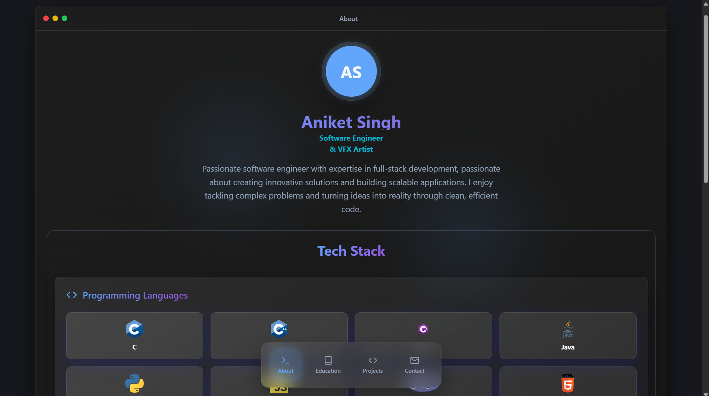

# Aniket Singh Windows11 Theme Portfolio
Welcome!
A sleek and modern developer portfolio designed with a Mac OS -inspired UI. This portfolio showcases sections like **About Me**, **Projects**, **Education**, **Contact**, and includes a downloadable **Resume**. Built to reflect the style and user experience of the Mac OS, it offers a unique and interactive way to present your work and personality.

## 🚀 Features

- Mac OS look & feel
- About Me and Education timeline
- Live Projects showcase
- Contact form integration
- Resume download option
- My other Portfolio Preview

## 🛠️ Technologies Used

- Vite
- TypeScript
- React
- shadcn-ui
- Tailwind CSS


## 📺 Live Demo

[🔗 View Live Portfolio](https://aniketmacfolio.vercel.app/)
---
Feel free to fork, explore, and customize this portfolio to make it your own!


## Setup

Download [Node.js](https://nodejs.org/en/download/).
Run this followed commands:

```bash
# Step 1: Clone the repository using the project's Git URL.
git clone <THIS_GIT_URL>

# Step 2: Navigate to the project directory.
cd <YOUR_PROJECT_NAME>

# Step 3: Install dependencies (only the first time)
npm install

# Step 4: Run the local server at localhost:8080
npm run dev

# Step 5: Build for production in the dist/ directory
npm run build
```
## 📸 Preview


